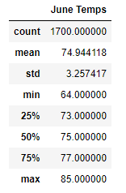
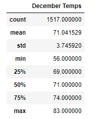

# Surfs Up Analysis

## Overview
We are interested in opening a surf shop in Oahu and have turned to our friend, W. Avy for assistance in helping to turn the dream into a reality. In order to present our business idea to prospective investors, we need to collect and deliver data sets based on multiple criteria that will assist in the business proposal. 

W. Avy suggested to dive deeper and analyze temperature trends from the mid and end-year months to get a sense if the surf and ice cream shop can be sustainable year-round. Ultimately, this analysis should help to greater prove that if both months reflect favorable temperatures, that would further the argument to make Oahu the ideal first location for the business launch. 

## Results

Using Python, Pandas functions, and SQLAlchemy, we filtered the data to reflect all of the temperatures for the months of just only June and December for 2010 to 2017. Utilizing these tools, we obtained the following summary statistic for each month. There are a key differences to highlight when comparing both months of the 7- year time frame. 

**June Statistical Summary**

**December Statistical Summary**

1. Both average temperatures for both months are relative close to one another as they each display an average around the low 70s. While December has an average temperature of 71 degrees, it proves that in the winter month Oahu can have warm weather and arguable has comfortable climate for surfing and ice cream service. 

2. There is a significant degrees difference in terms of the minimum temperature experienced in both months. For June, the minimum temperature recorded as been 64 degrees while December previously displayed a temperature of 56 degrees. This low temperature recorded is not the ideal in terms of surfing or eating ice cream. 

3. The max temperatures of June and December are relatively similar as well. While December can display cooler temperatures it can be in line with experiencing warm weather similar to June. The maximum temperature for June has been 85 degrees and for December 83 degrees. 

## Summary
To gain more weather data for June and December, we can also analyze the precipitation experienced in these two months to gain further insight on a different weather condition separate from high/low temperatures. This could be another query to create and gain further insight on these two time frames of the year and their statistical analysis. What is the average rainfall, the highs/lows of rainfall, and the variation exhibited throughout the years. Another query we can create is to determine the active stations during the months of June and December. Determine which stations are available, the most actives ones to see how the total relates to how many are being used to collect all of this information. It will help to determine which active station is close to Oahu to prove the data’s validity. 

All in all, the results obtain from June and December for this project reflect that with the small variation of temperature, as to be expected by the different seasons that both months fall in, the temperature is generally consistent year round. Signifying that is should not be an issue for the surf shop to maintain its doors opened year round. While the temperature is a variable we cannot control, its consistency year round in terms of average temperatures further the argue that the surf and ice cream shop can be turned into a year-round venture. 
